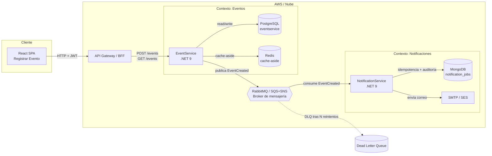
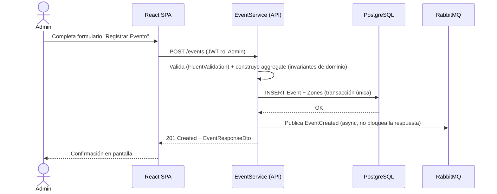
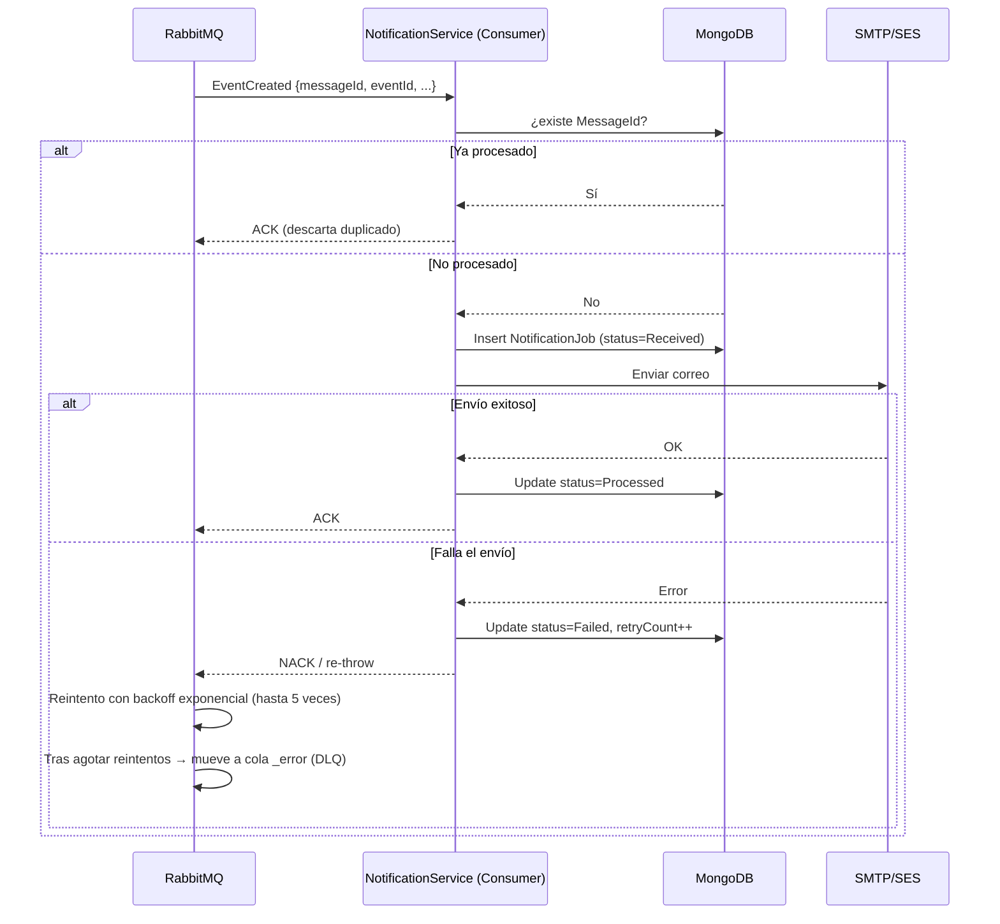
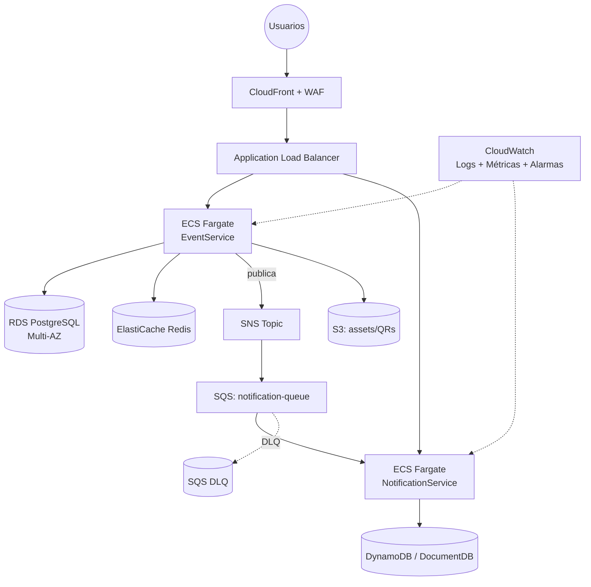

# Arquitectura — Plataforma de Eventos Online

## 1. Visión general

La plataforma se diseña como un **sistema de microservicios orientado a eventos**, desplegado en **AWS** (con opción híbrida para cargas on-premise si el cliente lo requiere), pensado para tres propiedades no negociables: **evitar sobreventa** (consistencia), **soportar picos de concurrencia** (preventas/lanzamientos) y **degradar de forma parcial** ante fallas (disponibilidad).

La comunicación entre servicios combina:
- **Síncrona (REST/HTTP + gRPC interno donde aplica):** para operaciones que requieren respuesta inmediata al usuario (login, búsqueda, checkout).
- **Asíncrona (eventos vía broker):** para todo lo que no bloquea la experiencia del usuario y necesita desacoplamiento, reintentos y trazabilidad (notificaciones, generación de tickets, auditoría, BI).

## 2. Microservicios propuestos

| Servicio | Responsabilidad | BD | Comunicación |
|---|---|---|---|
| **IdentityService** | Autenticación/autorización, OIDC/OAuth2, emisión de JWT, gestión de roles | PostgreSQL | Sync (login) |
| **EventService** | CRUD de eventos, zonas, precios, aforos, catálogo | PostgreSQL | Sync (CRUD/búsqueda) + Async (publica `EventCreated`, `EventPublished`) |
| **SearchService** | Búsqueda avanzada de eventos publicados, indexación | Elasticsearch/OpenSearch | Async (consume eventos de EventService), Sync (queries) |
| **InventoryService** | Control de aforo/disponibilidad por zona, reserva temporal de cupos | Redis (locks/contadores) + PostgreSQL (fuente de verdad) | Sync (reserva) + Async (libera cupos por timeout) |
| **OrderService** | Orquesta el flujo de compra/reserva (saga), estado del pedido | PostgreSQL | Sync (checkout) + Async (eventos de orden) |
| **PaymentService** | Integración con PSP externos, reembolsos | PostgreSQL (transacciones) | Sync (autorización) + Async (webhooks del PSP, resultado de pago) |
| **TicketingService** | Genera tickets QR/Barcode, valida check-in | PostgreSQL + S3 (PDFs/QRs) | Async (al confirmarse el pago) + Sync (validación en puerta, incluso offline-first) |
| **NotificationService** | Envío de email/SMS/push/WhatsApp, trazabilidad de envíos | MongoDB | Async (consumidor puro) |
| **UserService** | Perfiles de clientes, promotores, staff | PostgreSQL | Sync |
| **AuditService** | Trazabilidad centralizada de operaciones sensibles | MongoDB / OpenSearch | Async (consume de todos los servicios) |
| **BFF / API Gateway** | Punto de entrada único, rate limiting, agregación | — | Sync |

> Para el **MVP del reto** se construyen `EventService` y `NotificationService`, que son representativos del patrón que se replicaría en el resto de servicios (transacción local + publicación async + consumidor idempotente).

## 3. Diagrama de componentes (MVP + visión completa)

## 4. Flujo síncrono: Crear Evento

## 5. Flujo asíncrono: Notificación con idempotencia, reintentos y DLQ

## 6. Persistencia: SQL vs NoSQL por microservicio

| Servicio | Motor | Justificación |
|---|---|---|
| EventService | **PostgreSQL** | Datos altamente relacionales (Event ↔ Zones), transacciones ACID necesarias al crear evento + zonas atómicamente, consultas con filtros/rangos que se benefician de índices B-tree. |
| NotificationService | **MongoDB** | Documentos semi-estructurados por notificación, escritura de alto volumen sin necesidad de joins, esquema flexible ante nuevos canales (SMS/push/WhatsApp) sin migraciones. |
| InventoryService (visión completa) | **Redis + PostgreSQL** | Redis para contadores atómicos de aforo de baja latencia bajo alta concurrencia (`DECR`/Lua scripts); PostgreSQL como fuente de verdad durable. |
| SearchService (visión completa) | **OpenSearch/Elasticsearch** | Búsqueda de texto libre, facetas y ranking — no es el fuerte de una BD relacional. |

## 7. Autenticación, autorización y seguridad

- **OIDC/OAuth2** como estándar: un IdentityService actúa como Authorization Server (o se integra con un IdP externo tipo Keycloak/Cognito). Emite **JWT** firmados (RS256 en producción; HS256 simplificado en el MVP local).
- **Autorización por roles** vía claims del JWT: `Admin` puede `POST /events`; `Admin` y `User` pueden `GET /events`.
- **Boundaries de seguridad:**
  - El API Gateway valida el JWT antes de enrutar (defensa en profundidad además de la validación en cada servicio).
  - Cada microservicio valida su propio JWT — nunca confía ciegamente en la capa anterior (zero-trust interno).
  - Prevención de IDOR: los endpoints "por usuario" filtran siempre por el `sub` del token, nunca por un id recibido del cliente sin verificar pertenencia.
- **Manejo de errores seguro:** middleware global de excepciones que nunca expone stack traces ni detalles de infraestructura al cliente (ver `EventService.Api/Program.cs`).
- **Rate limiting:** limitador fijo por IP (60 req/min en el MVP) a nivel de gateway/API — mitigación básica ante abuso/DoS.
- **Logs:** nunca se registran tokens, contraseñas ni PII; solo identificadores técnicos (`correlationId`, `eventId`).

## 8. Resiliencia y alta concurrencia

- **Idempotencia del consumidor** (`MessageId` único indexado) evita efectos duplicados ante redelivery del broker.
- **Reintentos con backoff exponencial** a nivel de mensajería (MassTransit) y **Dead Letter Queue** para mensajes que agotan reintentos, evitando bloquear la cola principal.
- **Cache-aside con Redis** en `GET /events` para absorber picos de lectura sin golpear la BD en cada request.
- **Circuit breaker / retry con Polly** recomendado para llamadas salientes (PSP de pagos, servicios externos) en los servicios de checkout — no bloqueante para el resto del sistema si un proveedor externo degrada.
- **Escalado horizontal:** APIs stateless detrás de un load balancer (ALB) + auto scaling groups / Fargate; los consumidores de cola escalan de forma independiente según profundidad de cola (métricas de RabbitMQ/SQS).

## 9. Arquitectura en la nube (AWS)

En la variante **híbrida**, los componentes stateful sensibles (por ejemplo, cierta BD transaccional de pagos por cumplimiento normativo) permanecen on-premise y se conectan vía VPN/Direct Connect, mientras el resto de servicios stateless corre en AWS.

## 10. Sustentación breve

El diseño prioriza **desacoplamiento temporal** entre lo que el usuario necesita ver de inmediato (crear/listar eventos) y lo que puede procesarse en segundo plano (notificar, auditar). Esto permite que un pico de tráfico en la creación de eventos no degrade el envío de correos, y viceversa. La elección de PostgreSQL para EventService responde a la necesidad de una transacción atómica evento+zonas; MongoDB para NotificationService responde a un patrón de escritura de alto volumen sin necesidad de relaciones. La idempotencia y el patrón DLQ son la base para escalar este mismo patrón (mensaje → consumidor idempotente → efecto secundario) a los demás microservicios del dominio completo (tickets, auditoría, BI) sin duplicar lógica de infraestructura, solo el propio handler de negocio.
